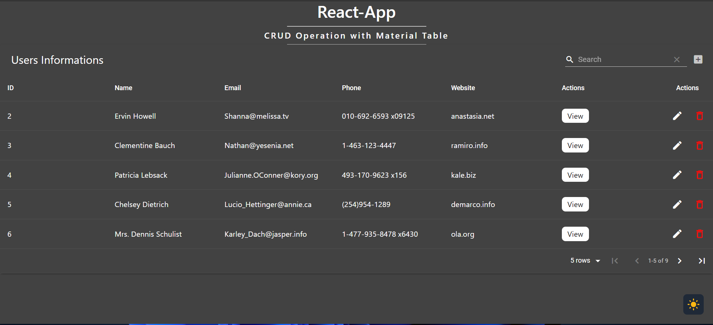

# React CRUD Application with Material Table and Theming

---

---

## Overview

A simple React CRUD application with Material Table for data manipulation and Theming functionality using Tailwind CSS.

## Technology Stack

- **React**: A JavaScript library for building user interfaces.
- **Material-UI**: A popular React UI framework for designing and developing responsive and accessible web applications.
- **Tailwind CSS**: A utility-first CSS framework for rapidly building custom designs.

## Installation

To run this project locally, follow these steps:

1. Clone the repository: `https://github.com/satish-kumar75/MaterialUi-table.git`
2. Navigate to the project directory: `cd MaterialUi-table`
3. Install dependencies: `npm install`
4. Start the development server: `npm start`
5. Open your browser and visit `http://localhost:3000` to view the application.
